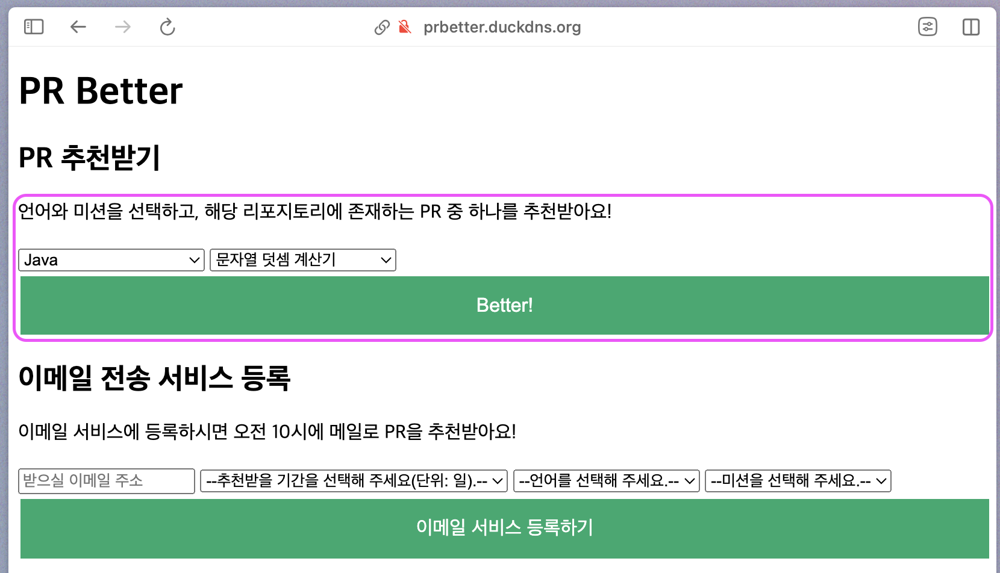
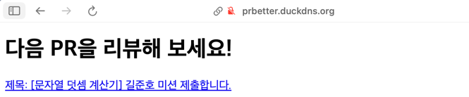
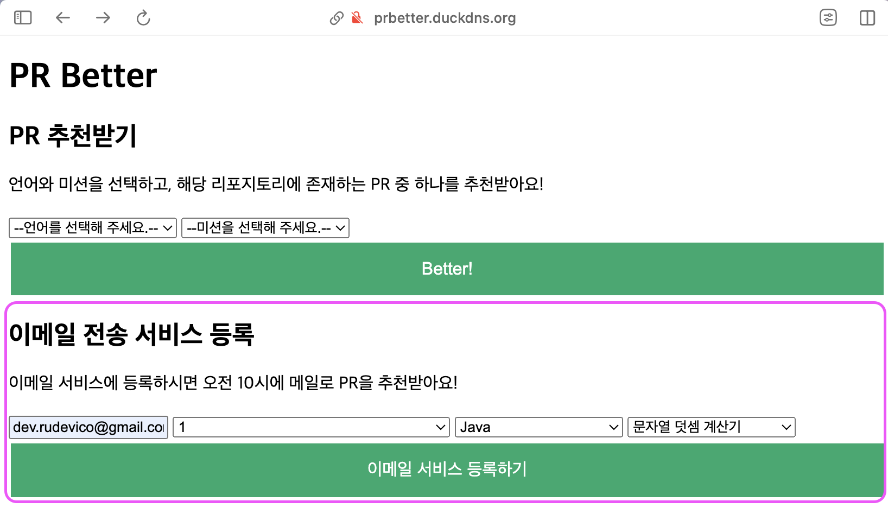
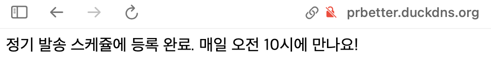
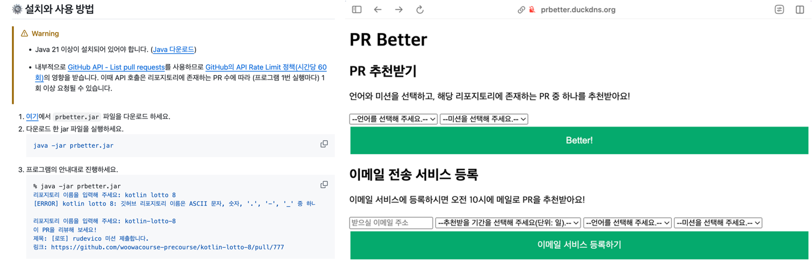
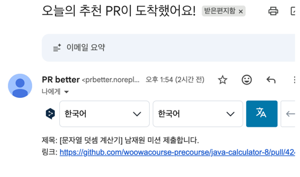
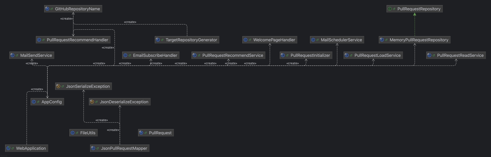

# prbetter-web
### Environment

[](https://www.oracle.com/java/)
[](https://cloud.google.com/)
[](https://www.duckdns.org/)
[](https://developer.mozilla.org/en-US/docs/Web/Guide/HTML/HTML5)
[](https://docs.oracle.com/en/java/javase/21/docs/api/jdk.httpserver/com/sun/net/httpserver/HttpServer.html)
[](https://gradle.org/)

### Development
[](https://jakarta.ee/specifications/mail/)
[](https://projectlombok.org/)
[](https://github.com/FasterXML/jackson)
[](https://www.slf4j.org/)

### Testing
[](https://junit.org/junit5/)
[](https://site.mockito.org/)
[](https://assertj.github.io/doc/)
[](https://htmlpreview.github.io/?https://github.com/HyoYoonNam/prbetter-web/blob/main/htmlReport/index.html)

### Meta
[](https://woowacourse.github.io/)
[](https://opensource.org/licenses/MIT)
[](여기에_도큐사우루스_사이트_URL_입력)


---
**prbetter-web**은 [prbetter-console](https://github.com/HyoYoonNam/prbetter-console)의 기능을 기반으로 제작한 경량 웹서비스입니다.

## 📃 목차
- [개발 배경](#-개발-배경)
  - [프레임워크 사용을 지양한 이유](#프레임워크-사용을-지양한-이유)
- [사용 방법](#-사용-방법)
  - [PR 즉시 추천받기](#pr-즉시-추천받기)
  - [매일 오전 10시에 메일로 추천받기](#매일-오전-10시에-메일로-추천받기)
- [콘솔 프로그램과 비교해서 무엇이 달라졌나요?](#-콘솔-프로그램과-비교해서-무엇이-달라졌나요)
  - [웹 서비스](#웹-서비스)
  - [GitHub API 호출 최소화](#github-api-호출-최소화)
  - [GitHUB API 호출시 서버측 인증 토큰 사용](#github-api-호출시-서버측-인증-토큰-사용)
  - [메일 정기 발송 서비스](#메일-정기-발송-서비스)
- [프로덕션 코드 구조](#-프로덕션-코드-구조)
- [클래스 다이어그램](#-클래스-다이어그램)
- [더 많은 정보](#-더-많은-정보)

## 💡 개발 배경
우아한테크코스 프리코스(이하 '우테코')에 참가하면서 느낀 상호 코드 리뷰 문화의 활성화를 위해 위해 **리뷰할 PR을 랜덤으로 추천해 주는** [prbetter-console](https://github.com/HyoYoonNam/prbetter-console)을 구현했었어요.

하지만 콘솔 프로그램에서는 사용자가 직접 jar 파일을 구동하고, 리뷰할 PR을 추천 받으려고 할 때마다 프로그램에 명령해야 하는 불편함이 있었어요.

이를 해결하기 위해 웹서비스로 구현함과 함께 메일 정기 발송 기능을 추가했어요!

### 프레임워크 사용을 지양한 이유
백엔드 개발자(지망자 포함)들에게 정말 유명한 김영한님의 스프링 강의를 수강하며 실습해 본 경험은 있으나,
강의를 따라가기만 했을 뿐 스스로 웹 서비스를 설계하고 구현하는 것은 이번이 처음이었어요.

콘솔 프로그램 구현을 마치고 난 뒤에는 약 1주일 정도의 시간만 남은 상태였는데요.

이 짧은 시간 동안 익숙하지 않은 스프링 프레임워크를 도입한다면, 웹의 본질적인 동작 원리를 이해하기보다는 프레임워크의 사용법을 학습하는데에 너무 많은 시간을 소모하게 될 것이라고 우려했어요.

'**내가 기술을 사용하는**' 것이 아니라, '**기술이 나를 사용하는**' 아이러니한 상황말이죠.

prbetter를 웹서비스로 구현하는 것만으로 쉽지 않은 여정이 될 프로젝트인데, 프레임워크의 기능들만 학습하다가 끝날 수는 없으니까요...!

그래서 이번 프로젝트의 목표는 '구현 코드가 조금 지저분하더라도, 빠르게 나의 첫 웹 서비스를 런칭하는 것'으로 정했어요.

## ⚙️ 사용 방법
먼저, http://prbetter.duckdns.org:8080/ 에 접속합니다.

### PR 즉시 추천받기


표시된 영역에서 언어와 미션을 선택하고, **Better!** 버튼을 누릅니다.

<br>



추천이 완료된 것을 확인할 수 있습니다.

### 매일 오전 10시에 메일로 추천받기


표시된 영역에서 이메일을 입력하고 추천받을 기간, 언어, 미션을 선택한 뒤에 **이메일 서비스 등록하기** 버튼을 누릅니다.

<br>



정기 발송 스케쥴에 등록된 것을 확인할 수 있습니다.

## ❓ 콘솔 프로그램과 비교해서 무엇이 달라졌나요?
### 웹 서비스

(좌측 사진) Java를 설치하고, jar 파일을 다운로드 하고, 로컬 환경에서 직접 실행시켜야 하는 콘솔 프로그램과 다르게,  
(우측 사진) 단순히 [웹사이트](prbetter.duckdns.org:8080)에 방문하는 것만으로 사용할 수 있습니다.

### GitHub API 호출 최소화
```java
public final class PullRequestInitializer {
    public void init(List<GitHubRepositoryName> repositoryNames) {
        log.info("리포지토리의 pull request 목록 초기화");
        for (GitHubRepositoryName gitHubRepositoryName : repositoryNames) {
            String filePath = "./pullrequest/" + gitHubRepositoryName.value() + ".json";

            // 파일로 이미 관리되고 있으면 파일에서 메모리 리포지토리로 불러 옴
            if (FileUtils.exists(filePath)) {
                log.info("{}에 대한 파일이 존재함. 파일 읽기: ", gitHubRepositoryName);
                loadService.loadFromFile(repository, gitHubRepositoryName, filePath);
                continue;
            }

            // 파일로 관리되고 있지 않으면 API를 호출해서 로드
            log.info("{}에 대한 파일이 존재하지 않음. API 호출: ", gitHubRepositoryName);
            loadService.loadFromGitHub(gitHubRepositoryName);
        }
    }
}

public final class PullRequestLoadService {
    public void loadFromGitHub(GitHubRepositoryName name) {
        log.info("Load pull requests from GitHub reposiotry: {}", name.value());
        readService.readAllPages(name).stream()
                .filter(PullRequest::isValidTitle)
                .forEach(pr -> pullRequestRepository.save(name, pr));

        File directory = new File("./pullrequest/");
        if (!directory.exists()) {
            directory.mkdir();
        }
        String filePath = "./pullrequest/" + name.value() + ".json";
        log.info("Write to file: path={}", filePath);
        List<PullRequest> founds = pullRequestRepository.findAll(name);
        JsonPullRequestMapper.writeToFile(filePath, founds);
    }
}
```
한번 GitHub API를 호출해서 로드한 PR 데이터들은 서버에서 파일로 캐싱하여 관리합니다.

덕분에 서버측에서 애플리케이션을 다시 실행할 때, 이미 파일로 저장되어 있는 경우에는 API 호출을 하지 않습니다.

<br>

**파일 캐싱 유무에 따른 애플리케이션 성능 비교**

| PR json 파일 캐싱 유무 | 애플리케이션 로딩에 걸린 시간(단위: 초) | API 호출 횟수(per_page=30 기준) |
| ---------------- | ----------------------- | ------------------------- |
| O                | 0.529                   | 0                         |
| X                | 177                     | 120                       |

### GitHub API 호출시 서버측 인증 토큰 사용
```java
public final class PullRequestReadService {
    private HttpRequest getRequest(GitHubRepositoryName name, int page) {
        URI apiUri = URI.create(API_URI_PREFIX + name.value() + API_URI_POSTFIX + "?per_page=30" + "&page=" + page);
        return HttpRequest.newBuilder()
                .GET()
                .uri(apiUri)
                .header("Accept", "application/vnd.github.json")
                .header("Authorization", "Bearer " + FileUtils.readString(GITHUB_AUTHORIZATION_TOKEN_PATH).strip())
                .build();
    }
}
```
prbetter-console에서는 `Authorization` 헤더를 요청에 포함하지 않았고, 로컬에서 실행되기 때문에 프로그램 실행자 IP 기반으로 적은 횟수(시간당 60회)의 API 호출만이 가능했습니다.

prbetter-web에서는 요청 헤더에 인증 정보를 포함하여 API 호출 제한을 크게 늘리고(시간당 5,000회), API 호출 자체도 서버측에서 담당하므로 사용자는 신경쓰지 않아도 됩니다. 

### 메일 정기 발송 서비스


정기 발송 스케쥴에 등록하면, 매일 10시 정각에 PR을 자동으로 추천받을 수 있습니다.

## 📂 프로덕션 코드 구조
```markdown
% tree src/main/java/prbetter/
src/main/java/prbetter/
├── WebApplication.java  ⬅️ 프로그램 진입점
├── core
│   ├── AppConfig.java
│   ├── domain
│   │   ├── GitHubRepositoryName.java
│   │   └── PullRequest.java
│   ├── initializer
│   │   └── PullRequestInitializer.java
│   ├── mapper
│   │   ├── JsonDeserializeException.java
│   │   ├── JsonPullRequestMapper.java
│   │   └── JsonSerializeException.java
│   ├── repository
│   │   ├── MemoryPullRequestRepository.java
│   │   └── PullRequestRepository.java
│   └── service
│       ├── PullRequestLoadService.java
│       ├── PullRequestReadService.java
│       └── PullRequestRecommendService.java
├── util
│   ├── FileUtils.java
│   └── TargetRepositoryGenerator.java
└── web
    ├── handler
    │   ├── EmailSubscribeHandler.java
    │   ├── PullRequestRecommendHandler.java
    │   └── WelcomePageHandler.java
    └── service
        ├── MailSchedulerService.java
        └── MailSendService.java

11 directories, 20 files
```

## 🔀 클래스 다이어그램


## 💬 더 많은 정보
prbetter를 개발하면서의 설계 과정, 문제와 해결 등은 [노션](https://rudevico.notion.site/2a03a35cb1a180e3a612e6084985a478?source=copy_link)에서 확인할 수 있습니다.
